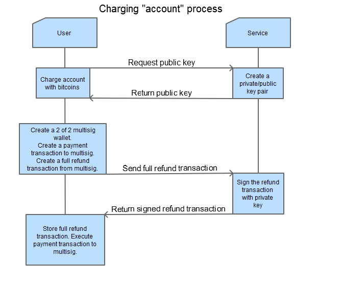
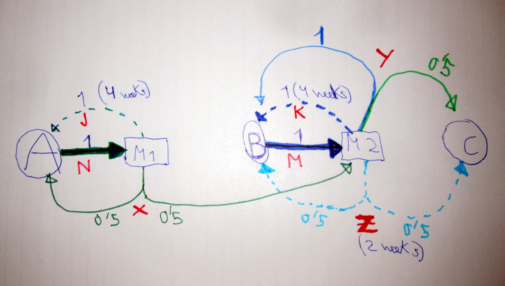
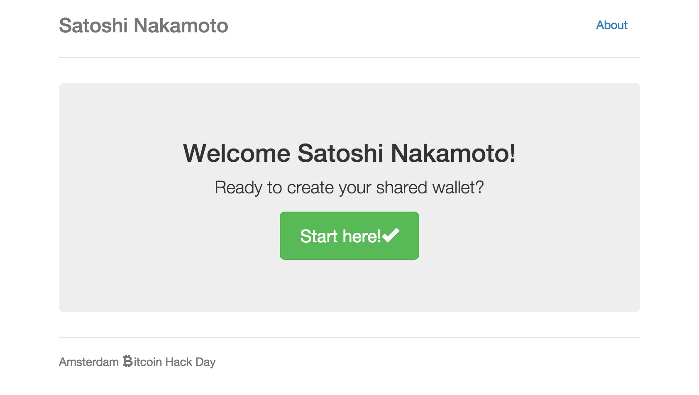
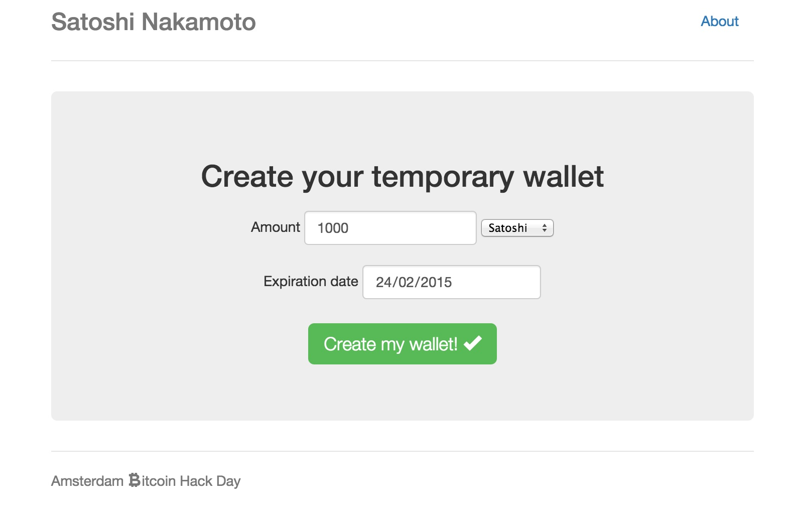
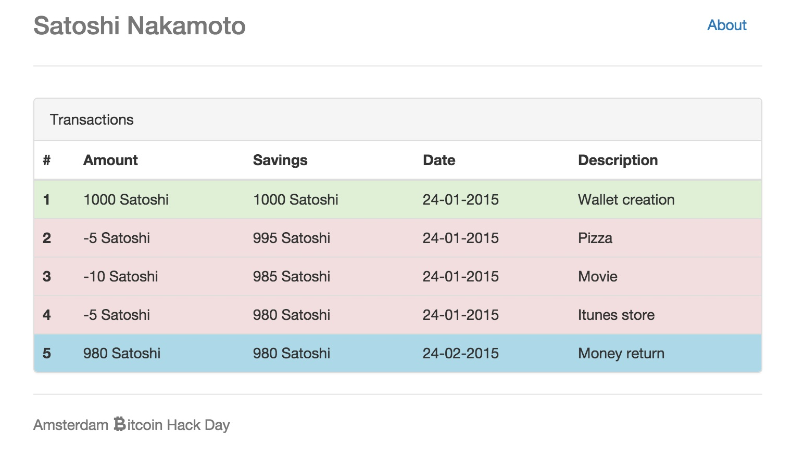

# bitcoin-hackathon

Project NoRiskWallet
====================

The problem
-----------

- As a user I want to buy a movie and start watching it immediately
- As a merchant I want to sell a movie and receive the payment instantly without trusting any third party or any risk of charge back or double spend

Current solutions
-----------------

- Bitcoin payments can not be trusted until they receive at least 1 confirmation in the blockchain (10 mins on average).
- Paypal and credit cards can always do a charge back and revoke the payment, even weeks after the transaction took place.

NoRiskWallet solution
---------------------

With NoRiskWallet you can fund a risk free wallet and all the money that you don't spend -after a deadline you set some time in the future-, it will return to you.

Now merchants can establish zero trust relations with NoRiskWallet to accept 0 confirmation transactions.

You can pay any merchant that has a NoRiskWallet instantly and with no risk.

Extras
------

- NoRiskWallet has to put a collateral with the merchants that is at least as big as the funding users have in their NoRiskWallet
- Funds from NoRiskWallet and customer are locked in multisignature addresses until the funds are spent or, in the worst case, until deadline set by the user is reached and funds are returned to original owners.

Implementation details
----------------------

The system is based on Bitcoin multisignature addresses (2 of 2), used between customer and NoRiskWallet and between NoRiskWallet and merchant.

Both users and merchants establish a payment channel with NoRiskWallet.

The user locks for sometime an amount that (s)he is willing to spend(partially or totally).

The merchant agrees to have a payment channel with NoRiskWallet where NoRiskWallet locks some funds for a limited period of time.

After payment channels are opened and confirmed in the bictoin blockchain a user can safely create, in collaboration with merchant and NoRiskWallet, two Bitcoin transactions that depend on each other and have to be signed in an specific order to:

1. pay the merchant without possibility of being double spend (without the merchant's signature)
2. return the NoRiskWallet locked collateral without possibility of loosing funds
3. customer having the final word in approving the whole chain of transactions

The trust is not required in the system because each player has different punishments or limitations to bad behaviour:
- For customer(A) to cheat and revert a payment to merchant(C) it requires our wallet(B) to sign contradicting transactions
- If our wallet(B) signs contradicting transactions to help customer(A), the merchant(C) will still receive the agreed payment, but instead of receiving the funds from A, the funds will be from B's collateral. So B is discouraged to help A.
- For merchant(C) to receive a payment from customer(A), it requires signatures from our wallet(B) and from A, so it's impossible that B or C get funds from A without A's approval.

The transactions should follow the flows described in the diagrams below:

Payment diagram(alternative representation):

Terminology
- **A**: Customer, **B**: NoRiskWallet and **C**: Merchant
- **M1**: Is a multisignature bitcoin address that requires 2 of 2 signatures to move funds, with signatures from Customer(A) and NoRiskWallet(B)
- **M2**: Is a multisignature bitcoin address that requires 2 of 2 signatures to move funds, with signatures from NoRiskWallet(B) and Merchant(C)

To perform a payment this is the exact order in which the transactions need to be signed:

1. **Merchant(C)** signs transactions **Y** and **Z** from M2
2. **NoRiskWallet(B)** signs transaction **Y** from M2 and **X** from M1
3. **Customer(A)** signs transaction **X** from M1
4. **NoRiskWallet(B)** signs transaction **Z** from M2

Notes:

- After point 3 is completed, the payment is ready but not yet confirmed in the Bitcoin blockchain, A could still double spent transaction X with the help of B and make transaction Y invalid. Step 4 is the insurance for C
- Transaction Z depends on inputs from M
- Transaction Y depends on inputs from M and X
- Transaction X depends on inputs from N
- Transaction K depends on inputs from M
- Transaction J depends on inputs from N

Front end mockups
-----------------

