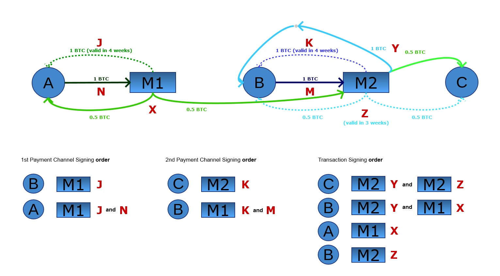

Transactions technical documentation
====================================

Knowledge references
--------------------

- **Micropayment channels**: https://bitcoin.org/en/developer-guide#micropayment-channel and https://bitcoinj.github.io/working-with-micropayments
- **Locktime** and sequence numbers: https://bitcoin.org/en/developer-guide#locktime-and-sequence-number

Transactions overview
---------------------
Payment diagram overview:

Terminology
- **A**: Customer, **B**: NoRiskWallet and **C**: Merchant
- **M1**: Is a multi-signature bitcoin address that requires 2 of 2 signatures to move funds, with signatures from Customer(A) and NoRiskWallet(B)
- **M2**: Is a multi-signature bitcoin address that requires 2 of 2 signatures to move funds, with signatures from NoRiskWallet(B) and Merchant(C)

To perform a payment this is the exact order in which the transactions need to be signed:

1. **Merchant(C)** signs transactions **Y** and **Z** from M2
2. **NoRiskWallet(B)** signs transaction **Y** from M2 and **X** from M1
3. **Customer(A)** signs transaction **X** from M1
4. **NoRiskWallet(B)** signs transaction **Z** from M2

Notes:

- After point 3 is completed, the payment is ready but not yet confirmed in the Bitcoin blockchain, A could still double spent transaction X with the help of B and make transaction Y invalid. Step 4 is the insurance for C
- Transaction Z depends on inputs from M
- Transaction Y depends on inputs from M and X
- Transaction X depends on inputs from N
- Transaction K depends on inputs from M
- Transaction J depends on inputs from N

Transactions in detail
----------------------

The transactions are divided in three flows, the first two payment channels established with NoRiskWallet some time before the actual payment needs to be executed. The a third flow for the actual instantaneous payment from customer to merchant

Establishing first payment channel between customer and NoRiskWallet
--------------------------------------------------------------------

The sequence below explains how to configure a payment channel. There is nothing different in this configuration from standard payment channels in previous documentation.

This payment channel should be created and confirmed in the Bitcoin blockchain at least two hours before the payment.

Transactions sequence:

1. **A** creates a public key APubK1.
2. **A** requests a public key from **B** BPubK1 and creates a multi-signature address **M1** using APubK1 and BPubK1 that requires 2 of 2 signatures to move funds.
3. **A** creates and signs a funding transaction (**N**) that sends 1 BTC to M1. But this transaction is **not yet released**.
4. **A** creates a refund transaction (**J**) that uses as input the output of transaction **N**. This transaction has a time-lock set to 4 weeks in the future.
5. **A** sends transaction **J** to **B** who signs and returns signed copy of **J** to **A**
6. **A** now has a valid refund transaction (**J**) and publishes funding transaction **N**. Once this transaction is confirmed in a Bitcoin block, the payment channel between **A** and **B** is open.

Establishing second payment channel between NoRiskWallet and merchant
---------------------------------------------------------------------

The sequence below explains how to configure a payment channel. There is nothing different in this configuration from standard payment channels in previous documentation.

This payment channel should be created and confirmed in the Bitcoin blockchain at least two hours before the payment.

**Note**: This sequence is exactly the same as the fir payment channel, only the actors and their roles in the transaction are changed.

Transactions sequence:

1. **B** creates a public key BPubK2.
2. **B** requests a public key from **C** CPubK1 and creates a multi-signature address **M2** using BPubK2 and CPubK1 that requires 2 of 2 signatures to move funds.
3. **B** creates and signs a funding transaction (**M**) that sends 1 BTC to M2. But this transaction is **not yet released**.
4. **B** creates a refund transaction (**K**) that uses as input the output of transaction **M**. This transaction has a time-lock set to 4 weeks in the future.
5. **B** sends transaction **K** to **C** who signs and returns signed copy of **J** to **B**
6. **B** now has a valid refund transaction (**K**) and publishes funding transaction **M**. Once this transaction is confirmed in a Bitcoin block, the payment channel between **B** and **C** is open.

Technology precursors
---------------------

- Reddit comments from user https://www.reddit.com/user/oakpacific
- Impulse from BitPay
- Vague explanations about payment hubs from Peter Todd

Known limitations
-----------------

- Transaction malleability can change transaction IDs making the chain of transactions discussed in this document unusable. The solution is to use the proposed BIP-65 OP_CHECKLOCKTIMEVERIFY https://github.com/bitcoin/bips/blob/master/bip-0065.mediawiki